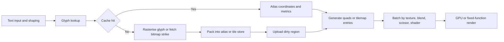
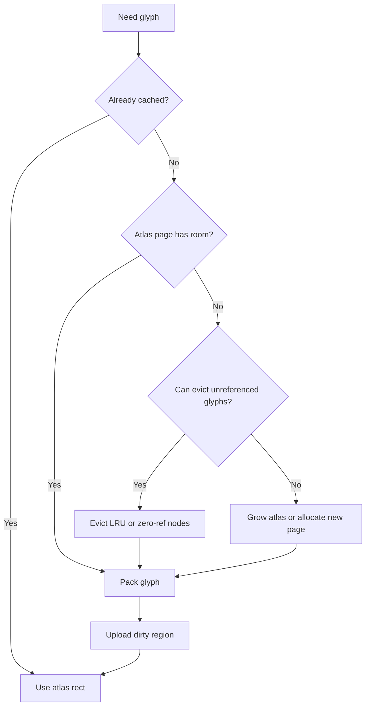

# Fast Bitmap Font Rendering on Modern GPUs and Nintendo DS

## Executive summary

The fastest practical text renderer depends less on “font technology” than on where the work is done and how often it is repeated. On a Nintendo DS, the fastest path is usually **pre-baked bitmap glyphs stored as tiles or sprites in VRAM**, with text updates performed by changing tilemap entries or OAM state rather than re-rasterising glyphs every frame. On modern GPUs, the fastest broadly applicable path is usually **CPU shaping/layout plus one or a few atlas textures, rendered as batched textured quads**, with state sorting so that most text submits in one draw call per texture/blend/scissor bucket. Tile-based mobile GPUs reward exactly this approach because it reduces driver overhead and external memory traffic. citeturn25search4turn25search1turn31search0turn3search2turn28search1turn36search12turn8search1turn8search4

For **small UI glyphs**, classic bitmap atlases remain the quality/performance winner. FreeType’s own model of embedded bitmap strikes and hinting exists precisely because small text benefits from pixel-grid-aware rasterisation, while Godot’s MSDF documentation explicitly warns that MSDF disables hinting and can therefore be less crisp and less readable at small sizes. MSDF and related distance-field methods are strongest when glyphs must scale widely or rotate, not when they must look maximally legible at 8–16 px. citeturn10search3turn10search4turn9search3turn39search4turn39search10

For **runtime atlas packing**, the central trade-off is simple: **Skyline** is usually the best incremental/runtime choice because it is fast and simple; **MaxRects** generally packs tighter but costs more CPU and bookkeeping. Jylänki’s survey found MaxRects to produce the best packings overall, while also noting Skyline’s better runtime behaviour; freetype-gl chose a skyline bottom-left atlas for exactly this reason. citeturn37view0turn37view1turn20search0

The core optimisation recipe is therefore stable across platforms: **precompute whenever possible, store glyphs compactly, snap positions carefully, batch aggressively, avoid unnecessary uploads, and profile the real bottleneck**. On DS that usually means tilemaps/palettes/VRAM banking discipline; on modern desktop/mobile GPUs it usually means atlas reuse, partial texture updates, premultiplied-alpha-aware filtering, and keeping text in the same render pass when possible. citeturn31search1turn31search3turn25search0turn7search0turn8search2turn23search0turn23search4

## Scope and assumptions

This report assumes that **“DS” means Nintendo DS unless stated otherwise**, as requested. It also assumes that the **target hardware is unspecified**, so the analysis covers both **general modern GPUs** and **constrained embedded or tile-based systems**, including Nintendo DS-style fixed-function 2D hardware and modern mobile tile-based GPUs. Where platform details differ materially, they are separated explicitly rather than averaged into a generic recommendation. citeturn31search3turn25search1turn8search1

A second assumption is that **text shaping and script handling are upstream concerns**. FreeType itself is a font engine, not a full text-layout engine, so this report concentrates on **glyph rasterisation, storage, atlasing, transfer, sampling, blending, batching, and profiling** rather than Unicode shaping algorithms or complex-script layout policy. That distinction matters because the fastest renderer is often bottlenecked not by rasterisation but by how glyphs are cached, packed, and submitted after shaping. citeturn10search1turn9search4

A third assumption is that “fastest” means a balance of **frame time, CPU overhead, GPU cost, memory footprint, and upload bandwidth**, not a single synthetic metric. GPU vendor guidance is clear that draw-call count, memory bandwidth, shader cost, and overdraw all matter; the best text pipeline therefore differs between a DS HUD, an MCU UI, a mobile game UI, and a desktop editor. citeturn8search4turn8search1turn23search0turn36search6

## Definitions and hardware context

A **bitmap font** is a font whose glyphs are already rasterised into pixel images, whether as monospaced sheets, tightly packed atlases, embedded bitmap strikes inside an outline font, or paletted/tiled glyph sets for fixed-function hardware. FreeType supports a wide range of bitmap-bearing formats, including SFNT bitmap fonts, PCF, Windows FNT, and BDF, and it will load embedded bitmaps by default when they exist for the requested size unless told otherwise. citeturn10search1turn10search2turn10search4

On Nintendo DS, there are two distinct fast paths for text. The first is the **native 2D engine path**: regular tiled backgrounds and tiled sprites. In DS tiled mode, images are built from 8×8 tiles referenced by map entries; regular backgrounds can use one 256-colour palette or sixteen 16-colour palettes, and sprites come in tiled or bitmap variants with their own palette constraints. The second is the **3D-texture path** used by libraries such as GL2D, where text is rendered as textured polygons backed by DS texture memory. These are not equivalent: tilemap text is usually faster and more memory-efficient for fixed-size HUD text, while textured quads are more flexible for arbitrary scaling/rotation and atlas reuse. citeturn25search1turn24search1turn25search3turn31search0turn3search2

The DS also has hard architectural constraints that make bitmap fonts attractive. VRAM is explicitly banked, the main 2D engine and sub engine each expose fixed numbers of backgrounds/sprites, and the 3D engine consumes main-engine layer 0. BlocksDS notes that regular tiled backgrounds support up to 1024 tiles, sprites top out at 128 per screen, and applications must think explicitly about VRAM allocation between 2D and 3D users. That naturally favours text systems based on small paletted glyph tiles, pre-generated atlases, and coarse-grained VRAM updates. citeturn25search1turn25search2turn3search5turn31search3

On modern desktop GPUs and mobile GPUs, the dominant text path is different: text is usually rendered as **textured quads** using a bitmap atlas or a distance-field atlas, with draw-call minimisation as a primary objective. ARM’s guidance is explicit that draw calls are not free, that atlases reduce texture changes, and that text packed into a font atlas can often be drawn in a single call. Mobile GPUs additionally use tile-based rendering internally, so keeping work in one pass and avoiding unnecessary framebuffer round-trips matters for bandwidth and power. citeturn36search12turn8search4turn8search1turn8search2

It is useful to distinguish two meanings of **tile-based rendering** in this topic. In the **DS sense**, tile-based rendering means a visible scene assembled from hardware tilemaps and sprites. In the **modern mobile-GPU sense**, it means a GPU architecture that bins primitives into on-chip tiles before fragment processing to reduce external memory traffic. The optimisation consequences overlap—reduce bandwidth, batch work, reuse state—but the implementation details are completely different. citeturn25search1turn31search3turn8search1

## Rendering pipelines and data formats

A rigorous way to view fast text rendering is as three families of pipelines.



The **CPU rasterisation pipeline** is the oldest and still the right answer on software-rendered UIs and tiny embedded systems. FreeType’s scanline converter produces coverage bitmaps, and LVGL’s font model is explicitly bitmap-centric: glyph data is stored with 1, 2, 4, or 8 bits per pixel, where the stored value represents opacity. This path keeps implementation simple and can be extremely fast when glyph counts are low and the target framebuffer is already CPU-owned, but it scales poorly when lots of text must move, animate, or alpha-blend every frame. citeturn38search2turn17search0turn17search3

The **GPU textured-quad pipeline** is the modern default. Glyph bitmaps are stored in one or more atlas textures, and text becomes a stream of quads with per-glyph UVs and metrics. libGDX’s SpriteBatch description is almost a textbook statement of the model: many rectangles for the same texture are accumulated and submitted together, and changing texture frequently hurts batching. freetype-gl makes the same design goal explicit—“one vertex buffer, one texture”—and Dear ImGui similarly builds one atlas texture for loaded fonts. citeturn28search1turn20search0turn19search4

The **DS tilemap pipeline** is a specialised fixed-function variant of the same idea, but faster when it fits the problem. The console/font path in BlocksDS uses a text background layer and prints by manipulating map/tile state; for HUDs, menu labels, counters, and diagnostic overlays, that can beat any 3D textured solution because the hardware is built to fetch small paletted tiles directly. If you need arbitrary-size, transformed, or atlas-subrect rendering, GL2D uses the DS 3D hardware to draw textured polygons from atlases instead. citeturn25search4turn25search1turn3search2

### Storage formats

At runtime, the most important storage distinction is not “PNG vs BMP”, but **what the GPU or hardware actually samples**.

| Runtime representation | Best use | Strengths | Weaknesses |
|---|---|---|---|
| **Hard-mask / 1-bit bitmap** | Pixel fonts, tiny retro UIs | Minimum memory, crisp integer-scale results, trivial sampling; msdf-atlas-gen identifies hard-mask atlases as non-antialiased and non-scalable. citeturn14search0 | Poor scaling, no antialiasing. |
| **Grayscale coverage atlas A8/R8** | Small modern UI text | Simple shader, good small-size readability, tintable at draw time, works with premultiplied-alpha pipelines. citeturn7search0turn28search1turn19search0 | Needs separate sizes or raster cache if scaling a lot. |
| **Paletted tiled glyphs** | DS and similar hardware | Very low memory footprint; DS 2D hardware natively supports 4 bpp and 8 bpp tiled backgrounds/sprites. citeturn25search1turn24search1turn31search0 | Platform-specific limits on palette count, colour depth, cell size. |
| **BMFont atlas with metadata** | Cross-engine bitmap-font interchange | Standard metadata includes x/y, width/height, xoffset/yoffset, xadvance, page, channel, kerning; supports text/XML/binary descriptors. citeturn30search0turn30search2 | Descriptor parsing required; still just bitmap quality. |
| **SDF** | Widely scaled monochrome glyphs | Scalable, compact, good for outlines/shadows; libGDX and Valve-style pipelines rely on linear filtering and thresholding. citeturn15search0turn33search0 | Corners soften; small text often loses readability. |
| **MSDF / MTSDF** | Broad scaling with sharp corners | MSDF preserves sharp corners; MTSDF adds a true SDF in alpha for soft effects. citeturn33search0turn14search0 | More channels, no hinting, stricter shader/sRGB discipline. |
| **Losslessly compressed bitmap font assets** | Memory-sensitive import/build pipelines | Godot BMFont import can use lossless compression; LVGL can compress bitmap fonts. citeturn18search3turn17search0 | Usually decompressed before or during render use; does not automatically reduce runtime shading cost. |
| **Lossy GPU texture compression** | Large, static, coarse text or icon sheets | ASTC and similar formats reduce memory bandwidth and footprint. citeturn27search1turn27search2 | For glyph edges, this is usually a quality trade; for fonts it is an engineering choice, not a default recommendation. |

Disk formats such as PNG, BMP, TGA, DDS, JSON, XML, or BMFont binary mostly affect **tooling and load time**, not the steady-state renderer. BMFont supports text, XML, and binary descriptors plus multiple image formats; msdf-atlas-gen can emit PNG/BMP/TIFF/raw formats and metadata in several forms. For runtime performance, what matters is the final resident representation in VRAM or GPU texture memory. citeturn30search0turn30search2turn14search0

### Atlas generation and packing

Atlas generation is where many engines quietly earn their performance. If glyph sets are known in advance, the renderer can use a **static offline atlas** and skip all runtime packing. If glyphs arrive dynamically—multiple languages, chat, mod content, or user-entered text—a **runtime packer plus cache** is required. Jylänki’s survey remains the most useful practical reference: MaxRects variants packed best overall, Skyline variants were somewhat faster, Guillotine was faster asymptotically but looser, and Shelf methods were mainly attractive for simplicity. citeturn37view0turn37view1

freetype-gl’s atlas explicitly uses a **skyline bottom-left** algorithm and presents that as a practical compromise for glyph storage. raylib’s SDF example likewise uses `GenImageFontAtlas(..., pack method: 1)` and documents this as a **Skyline algorithm**. Those are strong signals from production-oriented open-source code: for live glyph insertion, skyline is a very common sweet spot. citeturn20search0turn40search0

msdf-atlas-gen shows the other broad choice: **irregular bin packing** versus **uniform-grid atlases**. By default it packs glyphs tightly with varying dimensions, but it can also force a uniform grid with fixed cells. Uniform grids waste space, yet they simplify lookup, can improve coherence, and are especially attractive on fixed-function or retro-style engines where metadata cost and unpredictable fragmentation matter more than absolute density. citeturn21search0turn14search0



A useful operational summary is:

| Packer | Best fit | Practical reading of the evidence |
|---|---|---|
| **Uniform grid** | Monospaced fonts, DS-like image fonts, very low-complexity engines | Fastest lookup and simplest code, but poorest space efficiency. citeturn21search0turn18search0 |
| **Skyline** | Runtime incremental caches | Slightly worse occupancy than MaxRects, but simpler and faster enough for live atlas growth. citeturn37view0turn37view1turn20search0turn40search0 |
| **MaxRects** | Offline packing or slow-changing caches | Best packing efficiency in Jylänki’s tests; more bookkeeping. citeturn37view0 |
| **Guillotine** | When split-tree structure is useful or offline tooling already uses it | Fast and decent, usually not the best final occupancy. citeturn37view0 |
| **Shelf** | Tiny/simple implementations | Acceptable when simplicity dominates, rarely best on memory. citeturn37view0 |

A minimal skyline-style insertion loop looks like this:

```cpp
struct Node { int x, y, width; };   // skyline segment
bool insertGlyph(int gw, int gh, Rect &outRect) {
    int bestY = INT_MAX, bestX = INT_MAX, bestIndex = -1;

    for (int i = 0; i < skyline.size(); ++i) {
        int x = skyline[i].x;
        int y = fitAt(i, gw, gh);   // returns y if gw fits across nodes, else -1
        if (y >= 0 && (y < bestY || (y == bestY && x < bestX))) {
            bestY = y; bestX = x; bestIndex = i;
        }
    }
    if (bestIndex < 0) return false;

    outRect = {bestX, bestY, gw, gh};
    addSkylineLevel(bestIndex, outRect);
    mergeAdjacentNodes();
    return true;
}
```

That pseudocode matches the runtime spirit of freetype-gl and the skyline analysis in Jylänki: cheap incremental insertion, good-enough occupancy, low implementation risk. citeturn20search0turn37view1

## Sampling, quality, and shader choices

Texture sampling policy decides whether your atlas preserves edges or destroys them. Khronos’ texture parameter documentation is clear: **nearest** uses the single nearest texel, **linear** averages neighbouring texels, and mipmapped minification modes trade extra sampling for fewer aliasing artefacts. In practice, that means a pixel-font atlas wants nearest sampling and integer-aligned placement, whereas anti-aliased grayscale or distance-field atlases generally want linear filtering. citeturn7search2turn42search2

The important distinction is not simply nearest versus linear, but **matching the filter to the font type**.

| Atlas type | Recommended sampling | Why |
|---|---|---|
| **Pixel font / hard-mask bitmap** | Nearest, no mipmaps, strict pixel snapping | Preserves exact texels; linear filtering blurs the intended design. citeturn14search0turn7search2 |
| **Small grayscale bitmap UI text** | Usually linear for smooth AA; nearest only for intentionally crunchy styles | Coverage maps are designed to interpolate, but only if alignment and padding are correct. citeturn7search2turn7search0 |
| **Bitmap text heavily downscaled** | Mipmaps can help, with enough spacing/padding in the atlas | BMFont documentation explicitly recommends added spacing to avoid bleeding under mipmapping. citeturn30search4turn7search2 |
| **SDF / MSDF** | Linear filtering; optionally mipmaps after validation | libGDX and raylib both rely on bilinear filtering for SDF quality. citeturn15search0turn40search0turn33search0 |

Two subtle details matter more than many engines admit. First, **padding/spacing**: if glyphs sit too close in the atlas, linear filtering and mipmapping will bleed neighbouring glyphs into one another. BMFont’s own export documentation calls this out directly. Second, **alignment/pixel snapping**: for hinted or pixel-authored glyphs, many “blurry font” bugs are really fractional positioning bugs. FreeType’s sub-pixel positioning notes explicitly say that hinted outlines should be translated to a **rounded origin** before rasterisation to preserve grid fitting; msdf-atlas-gen also exposes `-pxalign` because baseline/origin alignment remains important even for distance fields. citeturn30search4turn26search3turn21search0

### Bitmap fonts, subpixel rendering, and hinting

On LCD panels, **subpixel rendering** can improve apparent horizontal resolution by addressing RGB sub-stripes separately, but it comes with strict preconditions. FreeType documents the trade-off clearly: unfiltered LCD rendering causes colour fringes, filtering is required to suppress them, and the ideal filter depends on the display and blending pipeline. LVGL adds the practical embedded-engine view: subpixel fonts need a special generation mode, require the correct RGB/BGR order, and cost about **three times more memory**. Direct2D further warns that ClearType on transparent surfaces is problematic enough that it automatically falls back to grayscale antialiasing for non-opaque alpha modes. citeturn9search1turn9search2turn17search0turn17search3turn7search4

That leads to a conservative but robust rule: **use subpixel rendering only for axis-aligned text on known LCD geometry and largely opaque backgrounds**. If your text is rotated, freely scaled, rendered into transparent intermediate targets, or displayed on unknown panel layouts, grayscale/hinted bitmap rendering is usually safer. This is not because subpixel rendering is bad; it is because its assumptions are narrow. citeturn9search1turn9search2turn7search4

### Bitmap versus SDF versus MSDF for small glyphs

The evidence is unusually consistent here. Valve-style SDF is excellent for magnification and special effects, but it is not the best tool for tiny, highly legible UI text. Godot explicitly states that MSDF has **no hinting** and can therefore be less crisp and readable at small sizes. msdfgen states that `screenPxRange()` must never be below 1 and that values below 2 make antialiasing failure likely. FreeType’s emphasis on embedded bitmap strikes and hinting reflects exactly the opposite design goal: make small glyphs land well on the pixel grid. citeturn39search4turn39search10turn33search0turn10search3turn10search4

MSDF improves on ordinary SDF by preserving sharp corners via multiple channels, and MTSDF adds a true SDF in alpha so the same atlas can support soft effects such as glows or broader outlines. That makes MSDF/MTSDF excellent for editors, zoomable UIs, map labels, 3D labels, and games that scale text dynamically. It does **not** make them an automatic upgrade for every bitmap-font problem. For fixed-size small UI text, a hinted grayscale atlas usually remains the better renderer. citeturn33search0turn14search0turn39search0turn39search4

### Alpha blending and colour handling

For modern GPU pipelines, the safest default is an **alpha-only or grayscale coverage atlas** tinted in the shader, using a pipeline that understands **premultiplied alpha**. Microsoft’s Win2D documentation is explicit that premultiplied alpha gives better results than straight alpha when filtering images or composing layers, because colour contribution and opacity are represented coherently under interpolation. citeturn7search0

On DS, colour handling is more hardware-specific. Regular tiled backgrounds and sprites are paletted; sprites use one palette while backgrounds can use one 256-colour palette or many 16-colour palettes depending on mode. In the DS 3D engine, texture formats include paletted 2-bit, 4-bit, and 8-bit textures, plus A3I5 and A5I3 formats that combine alpha and palette index, and direct-colour textures. That makes paletted bitmap fonts a first-class citizen on DS rather than a compromise. citeturn25search1turn31search0turn6search0turn6search1turn6search12

A representative modern fragment shader for a grayscale bitmap atlas is simple:

```glsl
// Bitmap coverage atlas, sampled from R or A channel
uniform sampler2D uAtlas;
uniform vec4 uColor;          // already premultiplied if your pipeline expects it
in vec2 vUV;
out vec4 oColor;

void main() {
    float a = texture(uAtlas, vUV).r;
    oColor = vec4(uColor.rgb, uColor.a * a);
}
```

And a representative SDF/MSDF shader follows the canonical published patterns:

```glsl
// Single-channel SDF
uniform sampler2D uAtlas;
uniform vec4 uColor;
uniform float uSmoothing;   // e.g. derived from scale or spread
in vec2 vUV;
out vec4 oColor;

void main() {
    float d = texture(uAtlas, vUV).a;
    float alpha = smoothstep(0.5 - uSmoothing, 0.5 + uSmoothing, d);
    oColor = vec4(uColor.rgb, uColor.a * alpha);
}
```

```glsl
// MSDF
uniform sampler2D uAtlas;
uniform vec4 uColor;
uniform float uScreenPxRange;
in vec2 vUV;
out vec4 oColor;

float median3(vec3 v) {
    return max(min(v.r, v.g), min(max(v.r, v.g), v.b));
}

void main() {
    vec3 msd = texture(uAtlas, vUV).rgb;        // must be treated as linear, not sRGB
    float sd = median3(msd);
    float screenPxDistance = uScreenPxRange * (sd - 0.5);
    float alpha = clamp(screenPxDistance + 0.5, 0.0, 1.0);
    oColor = vec4(uColor.rgb, uColor.a * alpha);
}
```

Those examples mirror the published libGDX SDF shader and Chlumský’s MSDF shader model, including the linear-colour requirement for MSDF channels. citeturn15search0turn33search0

## Batching, caching, memory bandwidth, and transfer strategy

The single most important render-side optimisation is still **draw-call minimisation**. ARM’s optimisation guide states plainly that applications issuing many hundreds or thousands of draw calls per frame are often draw-call limited, and it explicitly calls out putting screen text into a **font atlas** so text draws can be combined into a single call. libGDX exposes this reality directly through `renderCalls` and `maxSpritesInBatch`, while Dear ImGui models rendering as a set of draw commands grouped by texture and clip rectangle. citeturn36search12turn28search1turn19search4

In practice, a high-performance batcher sorts or accumulates by **texture, shader, blend mode, and scissor/clip state**, then emits a single dynamic vertex buffer update. The implementation pattern is mundane but effective:

```cpp
beginBatch();

for (const TextRun& run : visibleRuns) {
    selectFont(run.font);
    for (const GlyphPlacement& g : run.glyphs) {
        if (!atlas.contains(g.glyph)) {
            uploadMissingGlyph(g.glyph);   // cache miss path
        }

        State key{atlas.textureId(g.glyph), run.shader, run.blend, run.clip};
        if (key != currentState || vbo.isFull()) {
            flushBatch();
            bindState(key);
        }

        appendGlyphQuad(vbo, g.position, atlas.uv(g.glyph), run.colour);
    }
}

flushBatch();
```

That is the same basic idea whether the engine is SpriteBatch, freetype-gl, Dear ImGui, or a custom UI renderer. citeturn28search1turn20search0turn19search4

### Glyph caching and eviction

There are three stable cache strategies.

The first is a **static atlas**: all glyphs are known in advance, packed once, uploaded once. Dear ImGui’s classic font path operated like this, baking all loaded fonts into one atlas texture ahead of time. This is unbeatable for ASCII menus, debug UIs, and shipped game fonts with known ranges. citeturn19search4

The second is a **dynamic atlas with page growth**: new glyphs are packed as needed, and the atlas is resized or extra pages are allocated when full. Dear ImGui 1.92 moved in this direction with incrementally built, dynamically resized atlases, reducing the fragility of giant one-shot uploads. msdf-atlas-gen also exposes a `DynamicAtlas` concept for on-the-fly insertion. citeturn34search2turn14search0

The third is a **bounded cache with eviction**. FreeType’s cache subsystem is the cleanest primary source here: it explicitly limits total memory usage, maintains managed objects in most-recently-used order, uses reference counts to keep live items pinned, and flushes old nodes to make room for new ones. That is effectively an MRU/LRU-family design with pinning, and it is the right mental model for glyph pages as well: evict only unreferenced/unused glyphs, or rebuild whole pages when fragmentation gets too high. citeturn9search5turn34search1

A practical recommendation follows from those sources:

| Text workload | Cache policy |
|---|---|
| Known fixed charset | Static atlas, no eviction. citeturn19search4turn30search0 |
| Mostly fixed + occasional misses | Dynamic skyline atlas with page growth. citeturn20search0turn14search0 |
| Multilingual chat/log/editor | Multi-page cache with LRU or refcount-aware eviction, partial texture updates, background rebuild when fragmentation crosses a threshold. citeturn34search1turn23search0 |

### Memory versus speed

For bitmap text, memory and speed usually move in opposite directions.

| Choice | Faster? | Smaller? | Notes |
|---|---|---|---|
| Preload all glyphs/pages | Yes at runtime | No | Eliminates misses and uploads; ideal for fixed UI/game fonts. citeturn19search4turn30search0 |
| Lazy glyph generation | Not initially | Yes | Saves memory/start-up cost, but adds spikes on misses. citeturn14search0turn34search1 |
| Higher bpp grayscale | Usually yes for quality, same draw model | No | LVGL notes larger bpp sharply increases font size. citeturn17search0turn17search3 |
| Compression of bitmap fonts | No | Yes | LVGL reports roughly 30% slower render for compressed fonts. citeturn17search0turn17search3 |
| MSDF instead of multiple bitmap sizes | Yes when scaling frequently | Often yes overall | Avoids re-rasterising at size changes, but costs extra channels and loses hinting. citeturn39search0turn39search4 |

A fourth axis is **bandwidth**. On mobile tile-based GPUs, off-chip bandwidth is precious; ARM’s architecture notes that blending is efficient because the destination colour is already local to the tile, but extra passes and post-processing force more traffic to external memory. Therefore the fastest text path on mobile is often not only “one atlas, one batch”, but “one atlas, one batch, same pass”. citeturn8search1turn8search2

### DS VRAM and upload strategy

Nintendo DS deserves a specialised strategy because its cost model is dominated by **VRAM banking and limited write patterns**, not by draw-call count in the desktop sense. BlocksDS notes that applications mainly need to manage which VRAM banks are assigned to 2D and 3D engines; its advanced 3D examples show the standard bank-switch pattern of putting a bank into LCD mode so the CPU can write it, copying the data, and then returning the bank to a texture slot. BlocksDS also warns that VRAM writes are effectively 16-bit or 32-bit chunk operations and that large maps/backgrounds must stream only the visible pieces. citeturn3search1turn3search5turn25search0

That implies a DS text uploader should be designed around **dirty regions**, **VBlank-friendly block copies**, and **minimal bank churn**. A representative platform sketch is:

```cpp
// DS-style VRAM upload sketch
void uploadDirtyGlyphPage(const void* src, size_t bytes, int bank, void* vramDst) {
    waitForVBlank();                   // schedule where possible
    setBankToLCD(bank);                // CPU-accessible
    blockCopy16or32(vramDst, src, bytes);   // memcpy or DMA-style block copy
    setBankBackToTextureOrBG(bank);    // hand back to renderer
}
```

When the text is tilemap-based rather than texture-based, the fastest version is even simpler: keep the glyph tiles resident and update only **map entries** for changed characters. That shifts work from per-pixel transfer to per-character indirection, which is exactly what the DS 2D engine was built for. citeturn25search4turn25search1

One more DS-specific optimisation is worth stating plainly: **avoid per-frame glyph uploads if at all possible**. BlocksDS’ sprite tutorial frames the usual trade-off in general 2D terms: load all frames to VRAM for high VRAM use and low CPU cost, or stream frames into VRAM for low VRAM use and high CPU cost. Fonts are no different. If the font is known and reused heavily, keeping it resident is normally faster. citeturn31search0

## Implementations, benchmarking, and recommendations

### Concrete open-source implementations

| Project | Core font approach | What it demonstrates |
|---|---|---|
| **BlocksDS console / libnds** | Text backgrounds with console font layers | Best DS path for fixed-size text overlays, debugging, menus, and HUDs. citeturn25search4turn25search1 |
| **BlocksDS GL2D** | Atlas-backed textured polygons on DS 3D hardware | Flexible DS quads/spritesets; textures must be power-of-two. citeturn3search2 |
| **freetype-gl** | FreeType rasterisation + skyline atlas + one texture / one VBO | Canonical modern bitmap-atlas renderer. citeturn20search0 |
| **Dear ImGui** | Single shared atlas, now incrementally/dynamically managed in newer versions | Immediate-mode UI text with strict batching discipline and practical atlas engineering. citeturn19search4turn34search2 |
| **libGDX** | BMFont + SpriteBatch; optional distance-field path | Clear example of how batching, atlas reuse, and render-call counting affect performance. citeturn15search1turn15search0turn28search1 |
| **raylib** | TTF/BMFont/XNA sprite-font loading; SDF example uses skyline atlas packing | Simple but explicit end-to-end examples for bitmap and SDF rendering. citeturn40search0turn40search1 |
| **LVGL** | Bitmap fonts at 1/2/4/8 bpp, optional compression, optional subpixel | Excellent reference for low-end CPU-rendered systems and the memory/quality trade-offs. citeturn17search0turn17search3 |
| **Godot** | BMFont import and dynamic MSDF fonts | Good contrast between bitmap imports and scalable MSDF, with explicit caveats on hinting. citeturn18search3turn39search0turn39search4 |

### Benchmarking and profiling

A serious text renderer should measure at least **frame time**, **draw calls**, **glyph uploads or dirty bytes per frame**, **atlas occupancy**, **glyph-cache hit rate**, and **overdraw/fill cost**. Android GPU Inspector can expose draw calls, memory values, GPU performance data, render state, textures, and shaders for Android frames; NVIDIA Nsight Graphics provides per-frame and per-event analysis on desktop; Arm’s Mali Offline Compiler estimates arithmetic/load-store/texture cycle breakdown for shaders. Those are the right tools for deciding whether your text system is CPU-bound by layout/packing, GPU-bound by blending/fill, or bandwidth-bound by uploads and extra passes. citeturn23search0turn23search1turn23search4turn36search6

For 2D text, the most misleading metric is often average FPS. What actually hurts shipping products is **stutter on cache misses**: the first appearance of a new glyph, a page growth event, or a full atlas rebuild. Benchmarking therefore needs two cases: a **warm-cache steady state** and a **cold-cache worst case**. FreeType’s cache API exists explicitly to bound memory while handling these misses gracefully; if your runtime atlas has no equivalent telemetry, it is not production-ready. citeturn34search1turn9search5

Transparent text also makes **fill-rate and overdraw** relevant. ARM’s overdraw guidance shows why invisible or repeatedly blended pixels cost real work, especially on mobile; for normal glyph quads, trimming geometry to the opaque silhouette is rarely worth it because glyphs are small, but the principle still matters when large drop shadows, glows, or full-screen text effects are involved. citeturn8search7turn36search7turn36search5

### Decision matrix

| Constraints | Recommended approach | Rationale |
|---|---|---|
| **Nintendo DS, HUD/menu text, fixed size, low VRAM pressure** | **Pre-baked paletted tile or sprite font** | Native 2D hardware, minimal uploads, map/OAM-only updates. citeturn25search4turn25search1turn31search0 |
| **Nintendo DS, transformed/rotated/scaled labels** | **GL2D textured atlas** | Uses DS 3D hardware for arbitrary-sized textured quads; atlas improves VRAM use. citeturn3search2turn6search1 |
| **MCU / software UI** | **A1/A2/A4 bitmap fonts, optional compression only for large seldom-used sizes** | LVGL’s documented trade-off: compression saves memory but costs render speed. citeturn17search0turn17search3 |
| **Modern GPU, tiny crisp UI text** | **Hinted grayscale bitmap atlas at target size** | Best small-size readability; avoids MSDF’s no-hinting drawback. citeturn10search4turn39search4 |
| **Modern GPU, zoomable/scaling text** | **MSDF atlas** | Wide scaling without CPU re-raster cost; good corner preservation. citeturn33search0turn39search0 |
| **Modern GPU, strong outlines/glows/shadows** | **MTSDF or SDF with tuned range** | MTSDF keeps MSDF corners and adds soft-effect range in alpha. citeturn14search0 |
| **Dynamic multilingual/editor/chat text** | **Dynamic skyline or multi-page cache with refcount/LRU eviction** | Runtime insertion wins over maximal packing; eviction must be bounded and observable. citeturn20search0turn34search1turn37view1 |
| **Bindless-capable modern renderer with many atlas pages** | **Atlas pages plus descriptor indexing if needed** | Bindless reduces binding complexity, but fonts still usually benefit from atlas locality. citeturn29search0turn29search3turn36search12 |

### Practical optimisation recipes for low-end hardware

The most reliable low-end recipe is ruthless simplicity: **one format, one atlas, one shader, one batcher, one upload queue**. Use one grayscale or paletted representation, snap positions, remove runtime outline/glow effects unless you can prove they are cheap, and isolate cold-cache misses to loading screens or background preparation where possible. Every extra state permutation multiplies cache misses and draw breaks. citeturn28search1turn36search12turn34search1

For DS specifically, prioritise this order: **tilemap text first**, **sprites second**, **GL2D textured text third**. Keep glyphs resident, use paletted 4 bpp or 8 bpp assets, minimise bank switching, and update only changed map cells during VBlank-friendly windows. If you need many colours, use palette strategy before moving to more expensive per-pixel formats. citeturn25search4turn25search1turn31search0turn3search5

For mobile GPUs, prioritise **single-pass compositing** and **low upload bandwidth**. Keep text in the main UI pass, avoid post-process blurs on the entire UI layer, and make sure your shader is so small that the texture unit rather than ALU dominates. If using SDF/MSDF, validate colour space and derivative-based smoothing carefully; if you are only rendering 10–14 px toolbar text, do not pay the hinting penalty for an unnecessary distance field. citeturn8search1turn8search2turn36search6turn39search4

For desktop-class GPUs, the most practical performance lever is often not the shader at all but **cache behaviour and submission coherence**. Use static atlases for shipped fonts, keep dynamic atlases page-based instead of endlessly repacking one giant texture, expose atlas occupancy and eviction metrics to tooling, and treat “first glyph hit” latency as a product issue rather than a benchmark anomaly. citeturn19search4turn14search0turn34search1

### Open questions and limitations

One DS-specific detail remains **unspecified in the sources consulted here**: the exact modern-API-style analogue of nearest/linear/mipmap texture filtering for DS 3D texturing was not documented clearly enough in the primary DS materials gathered for this report. The DS recommendations in this report therefore focus on what is strongly documented—tilemaps, paletted formats, power-of-two textures, VRAM banking, and texture formats—rather than making overconfident claims about unavailable or weakly documented filter modes. citeturn3search2turn6search1turn25search1

Likewise, this report intentionally treats **text shaping, bidi layout, and colour-vector font formats** as adjacent topics rather than the main subject. They matter in production, but they do not change the central conclusion: for the fastest 2D rendering with bitmap fonts, the winning strategy is almost always to pre-rasterise, store compactly, upload minimally, sample appropriately, and batch everything that shares state. citeturn10search1turn17search3turn36search12