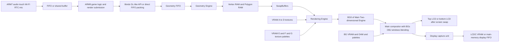
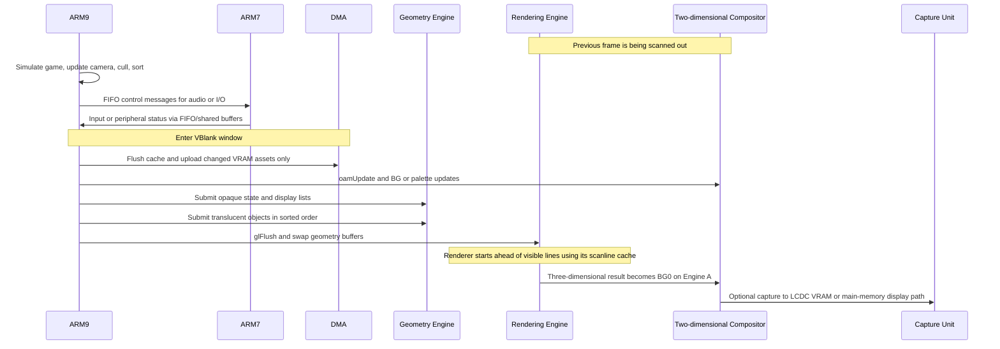

# Fast Rendering on Nintendo DS

## Executive summary

The Nintendo DS is fastest when you treat it as a collection of specialised fixed-function blocks, not as a tiny general-purpose GPU. In practice, the highest-throughput DS engines push as much work as possible onto the cheapest hardware path for each task: tile backgrounds for scrolling worlds and UI, sprites where OAM and scanline limits permit, and the 3D engine only where perspective, free-form rotation, texture mapping, fog, or per-polygon translucency materially help. Public documentation and source code make the core constraints very clear: an ARM946E-S at 66 MHz plus an ARM7TDMI at 33 MHz, 4 MB main RAM, 96 KB WRAM, 656 KB banked VRAM, tiny ARM9 caches and TCMs, two 2D engines, one 3D pipeline, and a scanline-oriented renderer with limited internal polygon/vertex memory and no programmable shaders. citeturn6view0turn6view1turn6view2turn6view3turn39view0turn39view1turn4search0turn4search1

If the goal is “render as fast as possible”, the biggest wins usually come from reducing *command traffic* and *memory traffic*, not from micro-optimising a few arithmetic instructions in isolation. The DS punishes main-RAM latency, cache misses, needless texture uploads, excess state changes, and naive per-object command submission. The strongest general-purpose tactics are: aggressive culling, state sorting, prepacked display lists sent with `glCallList()`, fixed-point maths everywhere, selective ARM-mode hotspots for multiply-heavy code, keeping hot code/data in ITCM/DTCM, leaving textures resident in VRAM, using paletted or compressed textures whenever art permits, and relegating audio, touch, Wi-Fi, and other peripheral chores to the ARM7 via FIFO/shared-buffer patterns. DMA matters, but mainly for the jobs the hardware triggers well: VRAM uploads, raster effects, main-memory display/capture, and geometry FIFO feeding. citeturn10view5turn23view0turn24view0turn25view0turn30view0turn39view4turn20view0

The request does **not** specify a target frame rate, genre, camera style, content mix, or whether the title is principally 2D, 2.5D, or full 3D. Those assumptions matter. Absent further constraints, the safest baseline target is the DS display cadence of about **59.826 Hz** for a single-screen renderer, with **30 Hz** a strategic fallback for dual-screen 3D/capture-heavy pipelines or very translucent scenes. citeturn42search6turn43view0

A practical rule of thumb follows from the public hardware model: if a scene can be expressed as “hardware scroll/affine on BGs + a modest number of sprites + a small amount of 3D”, that will usually beat “everything as textured quads in 3D”. BlocksDS’s own guidance is explicit that a tiled 2D background under GL2D/3D is “basically free” compared with drawing the same thing as hundreds of polygons. Conversely, the 3D path becomes attractive when you need freer compositing, texture formats, billboards, fog, or effects that exceed what OAM and the 2D blending path can do cleanly. citeturn31view0turn36search6turn43view2

## Scope and assumptions

This report focuses on the original DS/Lite-class public programming model exposed by ARM documentation, GBATEK, libnds/devkitPro, BlocksDS, and major open-source DS libraries and engines. Those are the strongest public sources available for hardware, APIs, examples, and optimisation patterns. ARM’s own manuals establish the CPU families involved; libnds/BlocksDS provide the current public API surface and examples; GBATEK remains the most detailed register-level public reference for DS video, memory, DMA, and 3D behaviour. citeturn4search0turn4search1turn7search1turn8view2turn32search5turn32search7

Because the request is broad, the recommendations below distinguish between hard documented facts and engineering inferences. Hard facts include things like VRAM bank sizes, texture formats, OAM update timing, memory timings, geometry FIFO DMA support, and scanline-cache behaviour. Inferences include questions such as “how much impact” a technique has in a real game, because that depends on whether the title is CPU-bound, geometry-bound, overdraw-bound, or VRAM-residency-bound. Where impact is stated qualitatively, it means *likely frame-time reduction when that subsystem is actually the bottleneck*, not a universal benchmark. citeturn6view2turn10view5turn23view0turn39view1

## Hardware constraints and display pipeline

The DS’s rendering ceiling is set by a small set of documented hardware boundaries. The table below consolidates the most important ones from GBATEK, libnds, and BlocksDS. The right-hand column is an engineering interpretation of what those facts imply for engine design. citeturn6view0turn6view1turn6view2turn6view3turn39view0turn39view1turn42search6turn24view0

| Subsystem | Publicly documented constraint | Why it matters for speed |
|---|---|---|
| ARM9 | ARM946E-S at 66 MHz; has video access, cache, ITCM/DTCM, hardware divider and square root access. | Use it for render submission, world simulation, matrix work, and any hot loops that benefit from cache/TCM. |
| ARM7 | ARM7TDMI at 33 MHz; owns audio, touch, microphone, RTC, Wi-Fi, and can access C/D VRAM if mapped. | Keep peripheral work and audio here; do not casually turn it into a second gameplay CPU unless profiling justifies the contention and memory complexity. |
| Main RAM and WRAM | 4 MB main RAM; 96 KB WRAM; ARM9 also has 32 KB ITCM, 16 KB DTCM, 8 KB I-cache, 4 KB D-cache. | Main RAM is precious and relatively slow; hot code/data should avoid it when possible. |
| VRAM | 656 KB split across banks A–I with bank-specific mappings for BG, OBJ, textures, palettes, LCDC, or ARM7 WRAM. | Asset residency strategy matters early; careless rebanking or overcommitting banks produces stalls, upload hazards, or feature conflicts. |
| OAM and palettes | Separate per-engine OAM/palette areas; OAM updates via libnds must happen in VBlank. | Sprite-heavy engines should treat VBlank as a hard scheduling boundary. |
| Two-dimensional engines | Engine A: up to 512 KB BG VRAM, 256 KB OBJ VRAM, plus 3D/capture/VRAM-display/main-memory-display support; Engine B: up to 128 KB BG and 128 KB OBJ. | Place features deliberately: Engine A is the “premium” display path. |
| Three-dimensional pipeline | Separate geometry and rendering engines; double-buffered polygon/vertex RAM; documented 6144 vertices per frame and up to 2048 triangles or 1536 quads; 104 KB polygon RAM and 144 KB vertex RAM. | Command count and polygon organisation matter as much as raw model size. |
| Display timing | 256×192 per screen at about 59.826 Hz; 3D can naturally drive one screen, and dual-screen 3D normally costs you to about 30 FPS through capture-style approaches. | A 60 Hz single-screen target is realistic; dual-screen 3D should be treated as a deliberate trade. |
| DMA | Four DMA channels per CPU; ARM9 modes include immediate, VBlank, HBlank, display start, main-memory display, cartridge, and geometry FIFO. | DMA is strongest when you exploit its trigger modes, not when you replace every `memcpy()` on instinct. |

### CPU, memory and VRAM realities

ARM9 memory service is highly uneven. GBATEK’s published timing tables show that cacheless ARM9 reads from main RAM are substantially slower than accesses to WRAM/BIOS/I/O/OAM, while TCM/cache hits are dramatically faster still. The ARM9 cache is only 8 KB instruction plus 4 KB data, with 32-byte lines; ITCM and DTCM are 32 KB and 16 KB respectively. This is exactly why DS engines often gain more from *layout* and *residency* work than from heroic algorithmic cleverness. If a hot loop and its working set fit in ITCM/DTCM/cache, the machine behaves very differently from a loop that streams structures from main RAM. citeturn6view2turn6view3turn25view0

VRAM is flexible but unforgiving. Banks A–D are the large 128 KB banks and can be assigned to texture slots; bank E is 64 KB; F and G are 16 KB; H is 32 KB; I is 16 KB. CPU access rules depend on the current bank mapping, and in texture/texture-palette modes VRAM is not CPU-mapped at all, so software must temporarily remap banks back to plain/LCDC access to initialise or modify them. All VRAM, palettes, and OAM accept only 16-bit and 32-bit writes on ARM9; 8-bit stores are ignored except for the special ARM7 plain-VRAM mode. citeturn6view1turn40search12

The two-dimensional engines retain the DS’s biggest hidden strength: they are excellent at drawing *without* per-frame CPU geometry work. Engine A and Engine B each expose four BG layers and sprite hardware, but Engine A additionally owns the premium features: 3D output, large-screen bitmap support, VRAM-display and main-memory-display modes, and the capture unit. A performant DS engine normally starts by deciding what absolutely deserves Engine A and what can safely live on Engine B. citeturn39view0turn39view2

### Two-dimensional and three-dimensional display modes

BlocksDS’s background documentation is a good practical summary of the DS BG families. Regular tiled backgrounds support up to 1024 tiles, flipping, and either one 256-colour palette or sixteen 16-colour palettes. Affine tiled backgrounds add rotation/scaling but are restricted to 256 tiles and one 256-colour palette. Extended backgrounds can be either affine-tiled or bitmap, and “large” bitmap backgrounds use the main engine only. GBATEK’s mode summaries line up with that public model and also make clear that Engine A alone supports the large 256-colour bitmap cases. citeturn35search0turn11view0turn11view2turn39view2

Sprites deserve similar discipline. Per screen, you get up to 128 sprites, but not an unlimited sprite workload per scanline. BlocksDS explicitly notes that the 2D engine has limited time to draw sprites on each horizontal line, with affine sprites costing more and double-size affine sprites costing more again. There are also only 32 affine transformation matrices shared across the 128 sprites of a screen. In other words: OAM is fast, but it is not free. citeturn34view0

For 3D textures, the trade-offs are unusually stark. Public libnds/BlocksDS docs expose seven formats: `GL_RGBA` direct 16-bit, paletted `GL_RGB256/16/4`, alpha-index formats `GL_RGB32_A3` and `GL_RGB8_A5`, and `GL_COMPRESSED` tex4x4. Two concrete optimisations matter immediately. First, paletted or compressed formats usually win on VRAM pressure and loading flexibility. Second, `GL_RGB` is an alias that libnds converts to `GL_RGBA` internally, and the libnds docs explicitly call out a performance penalty for doing so; prefer `GL_RGBA` directly if you need direct-colour textures. citeturn10view8turn30view0

The following table synthesises the public BG/texture format trade-offs. It is meant as a practical selection guide, not as a benchmark chart. citeturn35search0turn11view0turn11view2turn30view0

| Format family | Best use | Fast-path upside | Main limitation |
|---|---|---|---|
| Text tiled BG, four bits per pixel | UI, tilemaps, fonts, status layers | Lowest tile memory cost; flexible palette use; hardware scroll/priority | More palette management; less colour depth |
| Text tiled BG, eight bits per pixel | Richer tilemaps, colourful HUDs | Simple paletting; still cheap compared with bitmap redraws | Higher VRAM cost than four-bit tiled |
| Affine tiled BG | Mode-seven-like floors, rotatable maps | Hardware rotate/scale without per-pixel CPU work | Only 256 tiles and one 256-colour palette |
| Extended affine BG | More flexible transformed tilemaps | Restores larger tile capability and flipping | Still bank/mode constrained |
| Bitmap BG, eight or sixteen bits per pixel | Full-screen stills, simple framebuffers, software outputs | Simple addressing; sometimes useful for software compositing | Costs much more VRAM; bypasses many cheap tile advantages |
| Large bitmap BG | Special map/streaming cases on Engine A | Huge surface without manual polygon work | Expensive in VRAM and Engine A-only |
| `GL_RGB256/16/4` | Most 3D art, sprites-as-polygons, reused textures | Strong VRAM efficiency; easy palette sharing | Palette management required |
| `GL_RGB32_A3` / `GL_RGB8_A5` | Per-pixel translucency | Much finer transparency than per-polygon alpha alone | Requires blending and sorting discipline |
| `GL_COMPRESSED` | Natural-looking textures, large art sets | Excellent VRAM savings for suitable art | Poor for very detailed textures; extra data layout complexity |
| `GL_RGBA` | Small direct-colour art, special cases | Simplest direct use; no palette | Heavy VRAM footprint |

### Blending, windows, raster effects and display composition

The DS compositor can do several valuable effects in hardware: alpha blending, brightness increase/decrease, windows, object windows, mosaic, master brightness, and per-screen fades. GBATEK documents the blending equations and the exact layer-target logic for `BLDCNT`, `BLDALPHA`, and `BLDY`; BlocksDS shows the higher-level practical APIs. One important limitation that experienced DS codebases respect is that the 2D special-effects path works on the *top-most* OBJ pixel versus the next eligible lower-priority pixel, so ordinary OBJ-to-OBJ blending is not supported the way newcomers often expect. citeturn39view3turn19view2turn17search2

Raster effects are still a first-class DS technique. BlocksDS documents a particularly clear example: using HBlank-triggered DMA to update `REG_WIN0H` per scanline, turning rectangular windows into arbitrary silhouettes such as circles. This is the DS way of doing programmable-looking scanline effects: change registers per line, not pixels per frame. Done well, it is far cheaper than software redrawing. citeturn20view0turn15view0

Three-dimensional output is not a separate final framebuffer layer in the modern GPU sense. The geometry engine transforms/submits data into internal vertex/polygon RAM, `SwapBuffers` exchanges the geometry-side and rendering-side sets, and the renderer outputs the result as BG0 into the main two-dimensional video controller. GBATEK further documents that the 3D renderer is scanline-based, starts rendering 48 lines early during VBlank, and uses only a 48-line cache rather than a full 192-line framebuffer. That detail is crucial: “double buffering” in DS 3D is really about swapping geometry/polygon buffers, not flipping full-screen colour buffers the way a PC engine would. citeturn39view1turn10view9



The diagram above is a simplified public model built from GBATEK, libnds, and BlocksDS. It intentionally highlights the DS’s biggest practical truth: the ARM9 is usually bottlenecked by how efficiently it *feeds* the geometry/compositor path, not by raw shader complexity, because there are no programmable shaders on the DS public graphics stack. citeturn39view1turn31view0turn9view3

## Optimisation patterns that matter most

The DS has no single universal “best renderer”. What matters is whether a given frame is CPU-submission-bound, memory-bound, VRAM-bound, scanline-fill-bound, or sprite-scanline-bound. The next sections organise the most effective public techniques by the bottleneck they attack. citeturn23view0turn39view1turn34view0

### Use the cheapest renderer for each job

For static or scrolling maps, the two-dimensional BG engines are almost always cheaper than drawing equivalent geometry in 3D. BlocksDS says this bluntly for GL2D-style games: drawing a tiled background with 3D costs hundreds of polygons, whereas a tiled 2D background is “basically free” for CPU and GPU. That should be treated as default policy, not a corner case. Put HUDs, menus, text consoles, parallax tilemaps, and anything that is fundamentally “screen-aligned layer art” onto BGs or sprites first; move them into 3D only if you need effects the 2D hardware cannot supply cleanly. citeturn31view0turn17search2

Sprites remain the best choice for many actors, but only while you respect two real limits: scanline sprite time and affine-matrix scarcity. If your actor count is moderate and their transforms are simple, OAM is excellent. If you need masses of independently rotated/scaled/translucent objects, DS libraries such as GL2D and µLibrary exist precisely because using the 3D core to draw 2D quads can be more flexible than fighting OAM’s limits. citeturn34view0turn36search6turn43view2

For faux-LOD and draw-distance control, the DS rewards ruthlessness. On a 256×192 display, far objects often do not deserve full geometry or full-resolution textures. Publicly documented DS-friendly substitutes include billboards, fog-based fade-outs, and smaller textures. BlocksDS’s billboard examples show the standard fixed-function pattern; its fog discussion explicitly notes fog as a way to hide unloading/pop-in. That combination is the DS version of “impostors plus atmospheric cull”. citeturn42search6turn21view4turn31view0

### Reduce geometry and command traffic

Backface culling is table stakes. The GPU decides face orientation from vertex winding, and if your content pipeline emits correct winding, back culling is practically free rejection of geometry you do not need. More importantly, coarse culling should happen *before* display-list submission. The public `BoxTest` path exists precisely to prevent you from sending entire models that will not matter this frame. BlocksDS is explicit that this can save a lot of CPU time if the scene is organised around a few visibility tests and conditional draw submission. citeturn29view1turn28view4

Display lists are the DS’s closest public equivalent to a VBO/mesh buffer. `glCallList()` sends a packed command stream into the graphics FIFO via asynchronous DMA; BlocksDS’s display-list discussion is equally explicit that this is better than issuing commands one by one from the CPU. In practical engine architecture, that means: export static meshes as packed display lists, keep textures resident in VRAM, and transform/draw instances by surrounding `glCallList()` with matrix setup rather than regenerating per-vertex traffic every frame. citeturn10view5turn28view2

There is no classic indexed-vertex fetch stage in the public DS geometry path. The practical substitute is: use strips where possible, pack commands tightly, and exploit the cheaper vertex commands. BlocksDS documents four key classes: full `GFX_VERTEX16`, one-write `GFX_VERTEX10` for smaller ranges, `GFX_VERTEX_XY/XZ/YZ` to reuse one coordinate from the previous vertex, and `GFX_VERTEX_DIFF` for delta-coded vertices. That means exporter-side layout matters enormously: DS models should be packed to reduce writes, not just to minimise abstract triangle count. citeturn29view0turn28view0

A tiny but real public micro-optimisation from GBATEK is worth preserving in any custom low-level submission code: when texture mapping, the geometry engine works faster if commands are issued in the order **TexCoord → Normal → Vertex**. It is a small gain, but on the DS those small gains add up because they reduce FIFO and decode pressure rather than purely arithmetic cost. citeturn6view5

The following table is a prioritised synthesis of the most useful public rendering optimisations. “Likely impact” is qualitative and assumes that subsystem is actually constraining the frame. citeturn10view5turn23view0turn28view2turn31view0turn34view0turn39view1

| Technique | Main bottleneck attacked | Why it works on DS | Trade-off | Likely impact |
|---|---|---|---|---|
| Put tilemaps, HUD, text and many flat layers on BG hardware | CPU submission, geometry budget | BG hardware draws without per-frame polygon submission | Less free-form transforms than 3D | Very high |
| Use sprites while actor count is moderate | CPU and VRAM simplicity | OAM is cheap when scanline and affine limits are respected | Scanline overflow and 32 affine matrices | High |
| Prepack meshes as display lists and call them via DMA | ARM9 command overhead | DS graphics FIFO likes packed command streams | Export pipeline complexity | Very high |
| Sort by texture, palette and polygon state | ARM9 command overhead, VRAM churn | Fewer binds and state changes mean less CPU/FIFO traffic | Requires scene graph/material discipline | High |
| Use `BoxTest` plus engine-level frustum/sector checks | CPU submission and poly RAM pressure | Prevents work before draw submission | Bounding data and edge cases for large boxes | High |
| Prefer strips and cheaper vertex commands where legal | FIFO bandwidth | Fewer writes per vertex/polygon | Exporter/tooling complexity | Medium to high |
| Prefer paletted/compressed textures | VRAM pressure | Lets you fit more art permanently in VRAM | Palette/compression pipeline work | Very high |
| Share palettes with `glAssignColorTable()` | Palette VRAM pressure | Avoids duplicate palette storage | Requires material planning | Medium |
| Use billboards and fog for distant objects | Geometry and overdraw | Appropriate for the DS’s tiny display and fixed-function pipeline | Can look cheap if overused | Medium to high |
| Keep hot code/data in ITCM/DTCM/cache | Main-RAM latency | ARM9 fast memory is tiny but dramatically faster | Requires linker/code annotation care | High |
| Compile selected hotspots as ARM, not Thumb | Arithmetic-heavy hot loops | ARM mode enables stronger multiply/divide-by-constant lowering | Larger code size can hurt I-cache | Medium |
| Use DMA only for VRAM upload, geometry FIFO, capture or raster tricks | Bus scheduling | Exploits the DS’s trigger modes | DMA is not automatically faster than `memcpy()` | Medium to high |
| Manual translucent sort plus distinct polygon IDs | Correct translucent compositing | DS 3D translucency needs ordering discipline | CPU sort cost and content rules | Correctness-critical |

### Texture, palette and asset-residency strategy

Texture residency is a first-class performance feature on DS. Public BlocksDS guidance warns that while the GPU is reading a texture or palette, updating it is hazardous; if the GPU samples texture memory mid-upload it will see white pixels. Their recommendation is to load textures during loading screens unless you have a carefully controlled live-editing path. In practice, that means engines should reserve VRAM for *stable* resident textures first, then stream only a small minority of assets. citeturn30view0

Paletted formats are almost always the first optimisation pass to attempt on DS art. Public docs show the direct costs clearly: `GL_RGBA` is 2 bytes per pixel; `GL_RGB256` is 1 byte per pixel; `GL_RGB16` is 4 bits per pixel; `GL_RGB4` is 2 bits per pixel; compressed tex4x4 uses about 3 bits per pixel of texture memory plus palette data. Those are not abstract numbers — they directly decide whether an asset set lives in VRAM permanently or forces you into streaming. citeturn30view0

The palette system itself can be part of your effect budget. BlocksDS documents live editing of palettes and palette-loop effects, plus `glAssignColorTable()` for sharing one palette across multiple textures. Those are classic DS-grade optimisations: move visual variation into cheap palette changes instead of duplicating bitmaps. citeturn30view0

### Make the CPU fast where it actually hurts

The DS 3D path is fixed-point oriented from top to bottom. BlocksDS documents the relevant public formats: `v16` for vertices, `v10` for normals/small vertices, `t16` for texture coordinates, `f32` for matrix values, `fixed12d3` for depth values. Their recommendation is also blunt: avoid floating point in real-time game code because it is slow, and rely on compile-time constant folding or fixed-point conversions instead. citeturn26view0

On ARM9, selective ARM-mode compilation still matters. BlocksDS’s optimisation guide explains the trade: ARM code is wider and can bloat the I-cache footprint, but it is stronger for multiply-heavy code and for divisions by constants because it has 64-bit multiply forms such as `umull`/`smull`. Their example shows ARM-mode constant division lowering to multiply-and-shift while Thumb-mode may fall back to an `__aeabi_uidiv()` helper call. In DS terms: use ARM mode for genuinely hot, arithmetic-heavy leaf functions, not for everything. citeturn23view0

ITCM and DTCM are equally high-value. Public BlocksDS documentation shows the placement macros and notes that the stack already lives in DTCM by default. Hot code in ITCM and hot data in DTCM can materially reduce stalls, but overusing DTCM eats into stack headroom. This is the right home for matrix kernels, broadphase culling loops, decompression stubs, or fixed-function software helpers that dominate frame time. citeturn25view0

A final subtlety: because the ARM9 also has a hardware divider and square-root unit while the ARM7 does not have the same role in the public DS execution model, maths-heavy camera and rendering code belongs on ARM9 unless you have a compelling measured reason to do otherwise. citeturn24view0turn41search2

## Frame scheduling and dual-CPU orchestration

The DS is easiest to optimise when you schedule the frame around hard hardware boundaries instead of a generic “main loop”. Public libnds/BlocksDS behaviour gives the canonical anchors: `swiWaitForVBlank()` waits for VBlank, `oamUpdate()` should run during VBlank, `glFlush()` also synchronises with VBlank and swaps the 3D buffers, and DMA can be triggered on VBlank, HBlank, start-of-display, main-memory-display, or geometry-FIFO modes. IRQ support exists for VBlank, HBlank, VCount, DMA channels, geometry FIFO and more. citeturn10view3turn10view4turn10view9turn10view10turn15view0turn39view4

The ARM7 is best treated as an I/O coprocessor. BlocksDS states this directly: in practice the ARM7 is not a full second gameplay CPU so much as the machine that handles peripherals while the ARM9 drives the application logic. It *can* be used for custom work, but they explicitly warn that heavy ARM7 custom code steals time from audio/Wi-Fi/storage services, and that shared-main-RAM traffic between CPUs causes delays noticeable to the ARM9. In other words, DS multicore scaling is real, but it is not free. citeturn24view0

DMA needs the same discipline. libnds documents that DMA cannot see ARM9 cache contents, so the source range must be flushed before copying from main RAM. BlocksDS goes further and says that their optimised `memcpy()` is often the better default, because DMA copies from/to main RAM can block the CPU from accessing main RAM anyway. The highest-return DMA jobs are therefore the ones where the trigger or destination is special: VRAM uploads in well-controlled windows, geometry FIFO feeding, DISP_MMEM FIFO streaming, and HBlank/VCount register effects. citeturn10view0turn19view1turn23view0turn39view4

### Recommended frame choreography

A high-performance DS frame usually looks like this:

1. **During visible scanout**, the hardware is finishing the previous frame’s compositing while the ARM9 runs gameplay, culling, sorting, and matrix setup, ideally against hot data that lives in cache/TCM. citeturn39view1turn25view0  
2. **At or just after VBlank**, do OAM updates, any scheduled BG/map/palette changes, and tightly bounded VRAM uploads; flush ARM9 cache ranges first if DMA/shared buffers are involved. citeturn10view0turn10view10  
3. **Submit opaque 3D first**, batched by texture/state/material; use display lists for any reusable mesh. citeturn28view2turn10view5  
4. **Sort translucent objects back-to-front**, assign polygon IDs sanely, and end the frame with `glFlush(GL_TRANS_MANUALSORT)` if you are doing manual translucent ordering. citeturn29view3turn10view9  
5. **Let ARM7 continue audio/touch/Wi-Fi/storage service** in parallel, communicating via FIFO for small messages and shared buffers for larger transfers. citeturn24view0

### Buffering strategy

For **3D**, remember that the DS is not flipping a conventional colour framebuffer. The public model is geometry/polygon buffer swapping plus a 48-line renderer cache. So the “double buffering” you get from `glFlush()` is about geometry submission and render staging. If you need genuine framebuffer-like flipping, that is a *different* path: raw VRAM-display/main-memory-display/capture workflows on Engine A. citeturn39view1turn10view9turn33search1turn9view0

For **software-rendered or capture-based pipelines**, libnds exposes `MODE_VRAM_A` through `MODE_VRAM_D` (also `MODE_FB0`–`MODE_FB3`) and GBATEK documents Engine A’s VRAM-display and main-memory-display/capture behaviour. Inference: this is where double, triple, or even quad buffering becomes feasible — but only by spending VRAM banks that could otherwise be texture memory, and often only on the main engine. That trade is sometimes justified for software raycasters, post-process capture tricks, or dual-screen 3D, but it is rarely the first choice for a general 3D engine. citeturn9view0turn33search1turn39view2turn43view0

A representative frame flow is shown below. It intentionally separates *logic/culling* from *upload windows* and from *actual rendering* because the DS rewards that separation. citeturn10view9turn10view10turn24view0turn39view1



## Code patterns and source code atlas

The DS has **no programmable shader stage** in the public homebrew stack. The closest equivalent to “shader work” is fixed-function state and data preparation: matrix setup, vertex colours, normals, material/light state, texture formats, fog, toon tables, outline colours, and texture-coordinate generation. In libnds/BlocksDS terms, the core knobs are APIs such as `glPolyFmt()`, `glMaterial()`, `glTexImageNtr2D()`, `glCallList()`, `glFogColor()`, `glSetOutlineColor()`, texture matrices, and the various fixed-point vertex commands. citeturn39view1turn9view3turn26view0

The snippets below are **illustrative DS patterns**, written in libnds-style C and adapted from the public APIs and examples rather than copied verbatim. Each one is meant to highlight where the real hotspot sits.

### A batched opaque-plus-translucent render loop

```c
#include <nds.h>

typedef struct {
    int tex;
    const void *displayList;
    int x, y, z;       // f32-style world units kept as fixed point elsewhere
    u8 polyId;
} DrawItem;

void drawScene(const DrawItem *opaque, int opaqueCount,
               DrawItem *trans, int transCount)
{
    // Engine A on the main screen, textures left resident in VRAM
    videoSetMode(MODE_0_3D);
    glInit();
    glEnable(GL_TEXTURE_2D | GL_BLEND);
    glClearColor(0, 0, 0, 31);
    glClearDepth(0x7FFF);

    while (1) {
        swiWaitForVBlank();

        // Opaque pass: submit front-to-back or state-sorted.
        for (int i = 0; i < opaqueCount; ++i) {
            glBindTexture(0, opaque[i].tex);
            glPolyFmt(POLY_ALPHA(31) | POLY_CULL_BACK | POLY_ID(opaque[i].polyId));

            glPushMatrix();
                glTranslate3f32(opaque[i].x, opaque[i].y, opaque[i].z);
                glCallList(opaque[i].displayList);
            glPopMatrix(1);
        }

        // Translucent pass: sort back-to-front first.
        sortBackToFront(trans, transCount);

        for (int i = 0; i < transCount; ++i) {
            glBindTexture(0, trans[i].tex);
            glPolyFmt(POLY_ALPHA(15) | POLY_CULL_BACK | POLY_ID(i & 63));

            glPushMatrix();
                glTranslate3f32(trans[i].x, trans[i].y, trans[i].z);
                glCallList(trans[i].displayList);
            glPopMatrix(1);
        }

        glFlush(GL_TRANS_MANUALSORT);
    }
}
```

Why this is fast on DS: it keeps textures resident, amortises mesh submission through display lists, batches opaque state, and handles translucency in the order the DS renderer expects. The key public primitives here are `glCallList()` for asynchronous FIFO DMA, `glPolyFmt()` for polygon state, and `glFlush(GL_TRANS_MANUALSORT)` for translucent ordering. citeturn10view5turn10view6turn10view9turn29view3

### A representative display-list mindset

```c
// Not a full exporter output: this is the conceptual shape to aim for.
//
// Store mesh commands already packed as FIFO words.
// Reuse them for every instance; only change matrix state per draw.
typedef struct {
    const u32 *packedCommands;
    int textureId;
} StaticMesh;

static inline void drawStaticMeshInstance(const StaticMesh *m, int x, int y, int z)
{
    glBindTexture(0, m->textureId);

    glPushMatrix();
        glTranslate3f32(x, y, z);
        glCallList(m->packedCommands);
    glPopMatrix(1);
}
```

The DS does not expose “GPU vertex buffers” in the modern sense, but a prepacked display list is the practical equivalent: geometry encoded once, then DMA-fed into the FIFO each frame. Your exporter should also exploit strips and low-write vertex commands whenever the mesh topology allows it, because the DS cares about *command packing* as much as it cares about raw triangle count. citeturn28view2turn29view0turn28view0

### A safe DMA upload pattern

```c
#include <nds.h>

static inline void uploadToVram(const void *src, void *dst, u32 bytes)
{
    // ARM9 DMA cannot see dirty lines sitting only in cache.
    DC_FlushRange(src, bytes);
    dmaCopyWords(3, src, dst, bytes);
}

void onVBlank(void)
{
    // Apply sprite shadow state to real OAM during VBlank.
    oamUpdate(&oamMain);

    // Upload only assets that actually changed this frame.
    if (pendingBgUpload)
        uploadToVram(bgSource, BG_GFX, bgBytes);
}
```

This is the correct *shape* of an ARM9 DMA copy into VRAM or BG/OBJ memory: flush cache first, update OAM during VBlank, and do not assume DMA is automatically better than `memcpy()` for every copy. The public docs explicitly warn about cache visibility and also note that an optimised CPU `memcpy()` is often preferable unless you need DMA’s special destination/trigger semantics. citeturn10view0turn10view1turn10view10turn19view1turn23view0

### A selective ARM-mode hotspot

```c
#define ARM_CODE __attribute__((target("arm")))

ARM_CODE static inline unsigned fastBucket(unsigned v)
{
    // Example of a hot arithmetic helper.
    // In ARM mode, constant divisors are much more likely to become
    // multiply-and-shift code instead of a helper function call.
    return v / 3;
}
```

This is the kind of function to consider for ARM-mode compilation on ARM9: tiny, hot, arithmetic-heavy helpers used inside matrix, culling, or software transform loops. Public BlocksDS guidance shows why: ARM mode has stronger multiply forms, whereas Thumb may fall back to `__aeabi_uidiv()` for constant division. The counterweight is code size, so this should be a profiling-led decision. citeturn23view0

### An ARM7 control-channel pattern

```c
#include <nds.h>

typedef struct {
    void *buffer;
    u32  bytes;
} StreamCmd;

void submitAudioChunk(StreamCmd *cmd)
{
    // Shared-main-RAM path for larger data.
    DC_FlushRange(cmd->buffer, cmd->bytes);
    fifoSendAddress(FIFO_USER_01, cmd->buffer);
    fifoSendValue32(FIFO_USER_01, cmd->bytes);
}

void sendSmallControl(u32 value)
{
    fifoSendValue32(FIFO_USER_02, value);
}
```

This reflects the public ARM9↔ARM7 split: use FIFO value/address/data messages for control and small payloads, and shared buffers for larger transfers, with cache management on ARM9. BlocksDS explicitly warns that the ARM7 cannot see ARM9 cache contents and that heavy shared-main-RAM traffic can become a meaningful performance cost. citeturn24view0turn25view0

### Where to mine production-quality patterns

For baseline public APIs, the best starting points are **libnds** and **devkitPro’s `nds-examples`** repository. libnds provides the official homebrew API surface for general video, BGs, sprites, DMA, interrupts, cache, FIFO, and the OpenGL-like DS 3D layer; `nds-examples` is the canonical place to see those APIs applied in small, focused programs. citeturn7search1turn32search5turn38search0

For a more opinionated but still hardware-aware engine, **Nitro Engine** is one of the most useful public references. Its repository advertises static OBJ-derived models, DSMA-based animated models, all main texture formats including compressed textures, dual-3D support at a 30 FPS trade, 3D-accelerated 2D image functions, fog, shadow volumes, and examples. That makes it an excellent place to study the *engine architecture* around libnds rather than just isolated API calls. citeturn43view0

For skeletal animation, **AntonioND’s `dsma-library`** is directly relevant. Its README is exceptionally explicit: a DSM file stores a display list, DSA files store per-bone orientation/translation data, interpolation and animation blending are supported, and the method is designed to render animated models efficiently on DS hardware. The same README also exposes the matrix-stack/bone-count constraint that makes DS skeletal animation practical only with disciplined content authoring. citeturn43view1turn21view1

For “2D on the 3D core” approaches, public references include **GL2D/libgl2d_ds** and **µLibrary**. GL2D is documented as a simple DS rendering library using the 3D core for 2D work, while BlocksDS describes µLibrary as explicitly aimed at 2D games on the 3D GPU because the 3D path is more flexible than the 2D GPU for some workloads. Those are worth studying whenever OAM limits, affine-sprite costs, or 2D translucency constraints become painful. citeturn36search12turn43view2turn36search6

## Prioritised checklist

The checklist below is the practical implementation order I would recommend for a DS engine when “fastest possible rendering” is the top requirement. It is intentionally conservative: start with the highest-leverage structural choices, then move into targeted low-level work. The priority ordering is a synthesis of the hardware and source-code evidence discussed above. citeturn23view0turn25view0turn28view2turn31view0turn34view0turn39view1

| Priority | Implement | Why this comes early | Caveat |
|---|---|---|---|
| Highest | Decide which content is BG, sprite, and 3D content before writing the renderer | Wrong pipeline choice costs more than any micro-optimisation | Requires honest content analysis |
| Highest | Make texture residency a first-class VRAM plan | VRAM pressure dominates many DS renderers | Late rebanking is painful |
| Highest | Convert static meshes to prepacked display lists | Removes large amounts of ARM9 submission overhead | Needs exporter/tooling work |
| Highest | Batch opaque draws by texture/palette/polygon state | Minimises command churn and bind overhead | Requires scene sorting |
| Highest | Add coarse culling before submission | Prevents wasted CPU, poly RAM and scanline work | Needs bounds and visibility logic |
| Highest | Use fixed-point maths and LUTs broadly | The DS pipeline is fixed-point by design | Watch precision and range |
| Highest | Keep HUDs, tilemaps and text on BGs when possible | Two-dimensional hardware is the cheapest renderer on the machine | Less flexible than 3D quads |
| High | Use paletted or compressed textures first, direct colour second | Biggest VRAM win per unit effort | Art pipeline adaptation needed |
| High | Put hot ARM9 code/data into ITCM/DTCM where profiling justifies it | Fast memory is tiny but disproportionately valuable | DTCM usage can squeeze stack |
| High | Reserve ARM7 for audio and I/O, with FIFO/shared-buffer discipline | Avoids stalling ARM9 on peripheral work | Shared-main-RAM communication still needs care |
| High | Restrict DMA to strong-use cases | Prevents wasting effort on copies `memcpy()` already does well | Cache flush/invalidate is mandatory |
| Medium | Convert selected arithmetic hotspots to ARM mode | Good for matrix/culling/divide-by-constant helpers | Bigger code can hurt I-cache |
| Medium | Add billboard/impostor/fog-based LOD | Excellent fit for the DS display resolution | Needs content tuning to avoid cheap-looking scenes |
| Medium | Use HBlank/VCount DMA/IRQ for scanline effects | Produces high-value effects at low pixel cost | Scheduling/debugging complexity |
| Medium | Add manual translucent sorting and polygon-ID discipline | Required for correct layered translucency | CPU sort cost on large translucent sets |
| Later | Explore capture-driven dual-screen 3D or framebuffer pipelines | Powerful for some genres and demoscene effects | Usually a 30 FPS and VRAM-cost trade |
| Later | Explore triple/quad VRAM-frame buffering | Useful for software renderers or capture effects | Consumes precious Engine A VRAM banks |
| Later | Use clear-bitmaps or exotic capture trails | Nice special effects | Usually not the first route to raw speed |

If the project turns out to be **mostly 2D**, the optimal DS engine often looks like a tile/sprite engine with occasional 3D assist for special effects. If it is **mostly 3D**, the optimal engine usually looks like a display-list renderer with strict texture residency, strong culling, very selective translucency, and a deliberate use of BG hardware for everything that does **not** need the 3D pipeline. citeturn31view0turn43view0turn43view1